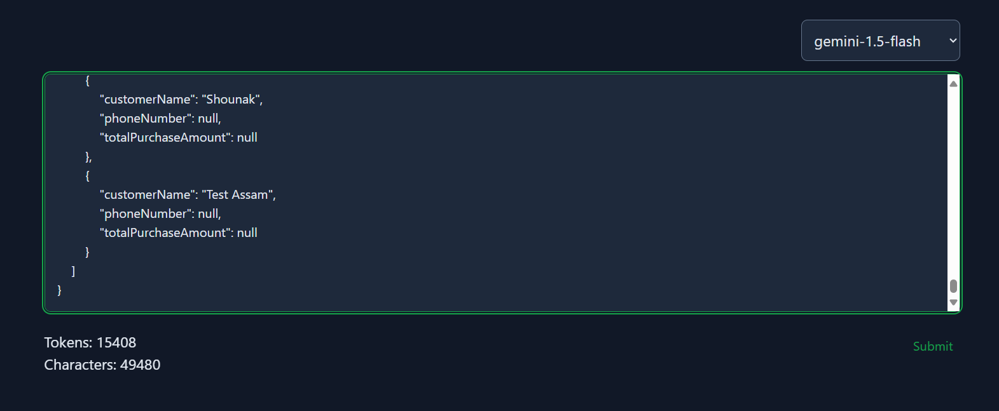

# Swipe Automate

A React application for Swipe that automates the extraction, processing, and
management of invoices data from various file formats.

# technologies

## frontend

React

Redux

tailwind

## backend

Nodejs

express

## AI model

Google Gemini 1.5 flash

why?


Best for:

    Image understanding
    Video understanding
    Audio understanding

# Approach

Accept three different file input formats PDF, images and excel on the frontend.

store the files in /uploads in the backend server. create a unique folder using uuid for each request to store the files for that specific request 

upload the files to gemini, wait for the files to become active. expect a Json response from the model which extracts the data from all the provided files. 

## JSON schema used 

```{
  "type": "object",
  "properties": {
    "response": {
      "type": "object",
      "properties": {
        "invoices": {
          "type": "array",
          "items": {
            "type": "object",
            "properties": {
              "serialNumber": {
                "type": "number"
              },
              "customerName": {
                "type": "string"
              },
              "productName": {
                "type": "string"
              },
              "quantity": {
                "type": "number"
              },
              "tax": {
                "type": "number"
              },
              "totalAmount": {
                "type": "number"
              },
              "date": {
                "type": "string"
              }
            },
            "required": [
              "serialNumber",
              "customerName",
              "productName",
              "quantity",
              "tax",
              "totalAmount",
              "date"
            ]
          }
        },
        "products": {
          "type": "array",
          "items": {
            "type": "object",
            "properties": {
              "name": {
                "type": "string"
              },
              "quantity": {
                "type": "number"
              },
              "unitPrice": {
                "type": "number"
              },
              "tax": {
                "type": "number"
              },
              "priceWithTax": {
                "type": "number"
              },
              "discount": {
                "type": "number"
              }
            },
            "required": [
              "name",
              "quantity",
              "unitPrice",
              "tax",
              "priceWithTax"
            ]
          }
        },
        "customers": {
          "type": "array",
          "items": {
            "type": "object",
            "properties": {
              "customerName": {
                "type": "string"
              },
              "phoneNumber": {
                "type": "string"
              },
              "totalPurchaseAmount": {
                "type": "number"
              }
            },
            "required": [
              "customerName",
              "phoneNumber",
              "totalPurchaseAmount"
            ]
          }
        }
      },
      "required": [
        "invoices",
        "products",
        "customers"
      ]
    }
  },
  "required": [
    "response"
  ]
}
```

handle the response json in the frontend assigning for three different states invoices, products and customers where state management is implemented using Redux

## how I achieved response length as high as 15000 tokens from a model with max response tokens of 8192 ?




used gemini chat session where the first message asks for the json and if the length exceeds prompts the model to stop abruptly and in the next response "continue the response" is passed to continue the json. responses are concatenated and checked for JSON validity using `JSON.parse` , if a valid JSON it is returned else continued.

```
async function getGeminiResponse(files) {
  const model = genAI.getGenerativeModel({
    model: 'gemini-1.5-flash',
    systemInstruction: 'give response in the expected json format',
  });

  const fileInputs = files.map((file) => ({
    fileData: {
      mimeType: file.mimeType,
      fileUri: file.uri,
    },
  }));

  let chatSession = model.startChat({
    generationConfig: {
      temperature: 1,
      topP: 0.95,
      topK: 40,
      maxOutputTokens: 8192,
      responseMimeType: 'application/json',
    },
    history: [
      {
        role: 'user',
        parts: fileInputs,
      },
    ],
  });

  let accumulatedResponse = '';
  let maxAttempts = 3;
  let attempts = 0;
  let result;

  const prompt = `Give the response in the expected format. 
    invoices with following fields serialNumber, customerName, productName, quantity, tax, totalAmount, date all these fields in the response are mandatory if there is no data for a field put null. 
    products with following fields name, quantity, unitPrice, tax, priceWithTax, discount all these fields are mandatory if there is no data for a field put null. 
    customers with customerName, phoneNumber, totalPurchaseAmount all fields are mandatory if there is no data for a field put null. 
    It is MANDATORY that you give for all three the invoices, products and the cutomers for every response. if the length of the response exceeds the limit you can continue the response from exactly same character when i prompt you 'continue the response' continue from exactly where you started `;

  while (attempts < maxAttempts) {
    try {
      result = attempts === 0
        ? await chatSession.sendMessage(prompt)
        : await chatSession.sendMessage('continue the response from where you stopped exactly');

      accumulatedResponse += result.response.text();

      try {
        let parsedJson = JSON.parse(accumulatedResponse);
        return parsedJson;
      } catch (parseError) {
        attempts++;
        continue;
      }
    } catch (error) {
      console.error('Error in Gemini API call:', error);
      throw new Error('Failed to get valid response from Gemini');
    }
  }

  throw new Error('Failed to get valid JSON response after maximum attempts');
}
```

# better approach (in progress)

initially handle each file, get the entire data for each file individually. concatenate the data from each file and then get the response for the concatenated data.

## why?

gemini 1.5 flash is pretty good with data extraction from PDF, images and jpg but getting one single response in one go for all the files makes the model to hallucinate and leave lots of data even the ones it is capable of extracting. It poorly performs to process and read between the files for example a image has product details which it can extract perfectly, a invoice pdf has the customer name and the invoice serial number, getting everything in a single response is an inability for the model to process data and understand between the data

Extracting all the data individually from the files, concatenating them and trying the generate response over that extracted text will resolve all those processing issues where here the model can reason between different data points. 

gemini 1.5 pro can reason upto 100k lines of code ( text )
so it is better to convert the files to text then try to extract the data for better reasoning and processing of the data

# demo


### Case 1
[](https://www.youtube.com/watch?v=ete-CnRn96E)

### Case 2
[](https://www.youtube.com/watch?v=UZzDVdeSDPs)

### Case 3
[](https://www.youtube.com/watch?v=ya-Ci6Y04tc)

### Case 4
[](https://www.youtube.com/watch?v=EAYcJNS8a0s)
